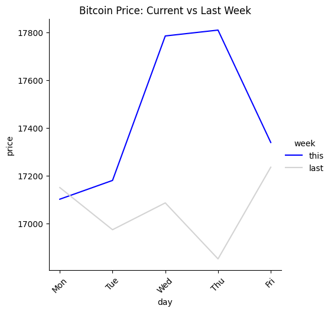

## Crypto Comparison
The goal of this notebook is to show an analysis which incites a prompt to the user.
Due to our technological advances, we have a desire to gather data and use them as information. However, there is an art in how we present data to our clients. Our data must be able to show and tell a story to the audience.

## Prompts

##### Compared to a certain coin, should the user trade user's current coin by looking at the historical trend?

### Data Analysis
The graph below shows this week's coin data versus last week's.
The coloring of the graph lines should pop to the user and quickly give away whether the current week's price is higher or lower than last week's.
In a quick glance of the graph, questions should arise from the user:
* Bitcoin is higher this week, perhaps I am doing well and I should keep.
* Bitcoin is surging, perhaps this is a trend. Should I buy more coins?
* Bitcoin lowered from last week; however, it is not that much lower. Perhaps, I should keep.
* Bitcoin is losing a lot in price. I should definitely sell.
    
  

API Service: Coingecko

References: 
Nussbaumer Knaflic, Cole (2015). Storytelling with Data
